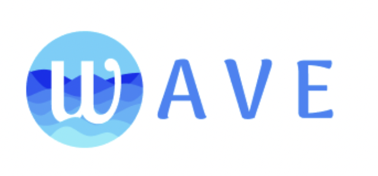
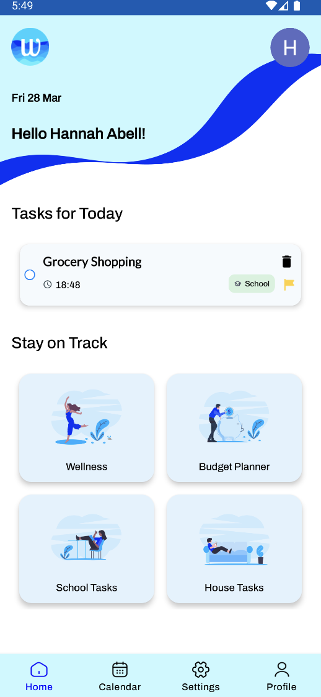
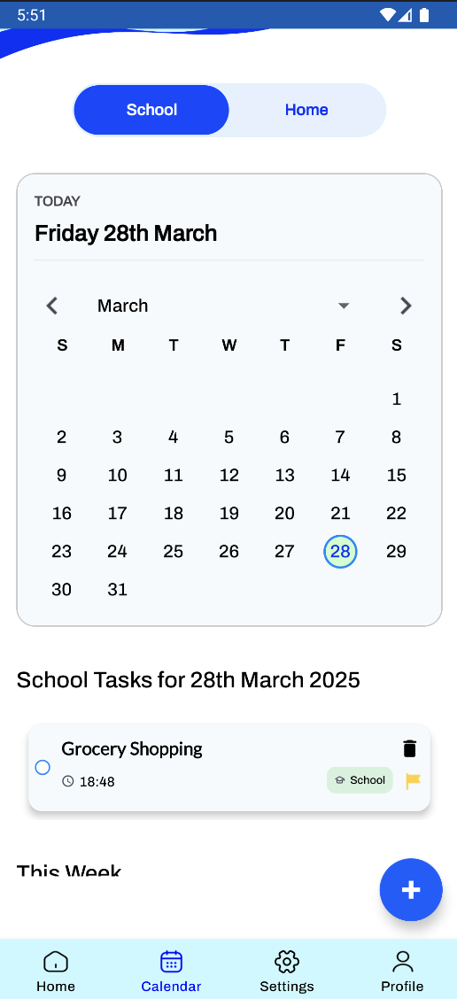

<!-- PROJECT LOGO -->
<br />
<div align="center">
  <a href="https://github.com/syro13/Wave_Frontend_Source_Code">
    
  </a>
 <p align="center">
    Wave is a wellbeing application designed specifically to support college students who want help in managing various aspects of their overwhelming and busy lives. Not only recognising this, but experiencing it, is what helped us to come up with this idea. Wave aims to help in a wide range of tasks from financial budgeting advice to task management down to general wellbeing, all in the aim of creating a better college experience and minimising the possibility of burning out.
    <br />
    <a href="https://github.com/syro13/Wave_Frontend_Source_Code"><strong>Explore our repo »</strong></a>
    <br />
    <br />
    <a href="https://github.com/syro13/Wave_Frontend_Source_Code">View Demo</a>
    &middot;
    <a href="https://github.com/syro13/Wave_Frontend_Source_Code/issues/new?labels=bug&template=bug-report---.md">Report Bug</a>
  </p>
</div>


<!-- TABLE OF CONTENTS -->
<details>
  <summary>Table of Contents</summary>
  <ol>
    <li>
      <a href="#about-the-project">About The Project</a>
      <ul>
        <li><a href="#built-with">Built With</a></li>
      </ul>
    </li>
    <li>
      <a href="#getting-started">Getting Started</a>
      <ul>
        <li><a href="#prerequisites">Prerequisites</a></li>
        <li><a href="#installation">Installation</a></li>
      </ul>
    </li>
    <li><a href="#usage">Usage</a></li>
    <li><a href="#roadmap">Roadmap</a></li>
    <li><a href="#contributing">Contributing</a></li>
    <li><a href="#license">License</a></li>
    <li><a href="#contact">Contact</a></li>
    <li><a href="#acknowledgments">Acknowledgments</a></li>
  </ol>
</details>


## 🛠️ Built With

* [](https://developer.android.com/studio)
* [](https://www.oracle.com/java/)
* [](https://developer.android.com/guide/topics/resources/layout-resource)
* [](https://firebase.google.com/)
* [](https://openai.com/)
* [](https://airbnb.io/lottie/#/)


<p align="right">(<a href="#readme-top">back to top</a>)</p>


<!-- GETTING STARTED -->
## 🚀 Getting Started

Follow these steps to get a local copy of the **Wave** app up and running on your machine.

### 📋 Prerequisites

Make sure you have the following installed:

- [Android Studio](https://developer.android.com/studio)
- [Java JDK 17+](https://www.oracle.com/java/technologies/javase-downloads.html)
- [Firebase Account](https://firebase.google.com/)
- [OpenAI API Key](https://platform.openai.com/)
- Internet connection (for API requests and Gradle sync)

---

### 🔧 Installation

1. **Clone the repository**

```bash
git clone https://github.com/your-username/Wave_Frontend_Source_Code.git

  ```
<p align="right">(<a href="#readme-top">back to top</a>)</p>

<!-- USAGE EXAMPLES -->
## 📱 Usage

Wave is designed to support students in managing their day-to-day life with ease, balance, and wellbeing. Here are a few key features in action:

### 🧠 AI-Powered Suggestions
Get intelligent task breakdowns and wellness tips based on your mood, time, and mental load.

Example Prompt: "Suggest a 30-minute wellness plan for a stressed student."
→ AI Response: "Take a 10-minute walk, journal your thoughts for 5 minutes, then listen to a calming playlist."

### 🏠 Home and School Task Management
Track and manage home chores easily. Tasks are categorized and color-coded based on their status: Pending, Completed, Cancelled, or Overdue.

### 💰 Budgeting Made Easy
Track your daily and weekly expenses with a clean, user-friendly budgeting interface. Get insights on where your money goes and receive AI-generated tips to save better.

📌 Example:
```text
Spent €20 so you have €160 left.
→ AI Suggestion: “Try cooking at home more this week. Here’s a simple 3-day meal plan under €15.”
 ```

### 🧾 Grocery & Notes
Use the grocery list popup to quickly jot down and check off daily household items.


### 🔁 Calendar Sync
View all your tasks in a calendar view to plan your week visually.

### 🌿 Wellbeing API
Wave connects to a custom-built Wellbeing API that offers blogs and podcasts to help you relax. Perfect for when you're feeling stressed, tired, or unmotivated. 

✅ Supports:

* Mindfulness 
* Sleep routine 
* Study/life balance plans
* Encouraging wellness 

<p align="right">(<a href="#readme-top">back to top</a>)</p>

<!-- ROADMAP -->
## 🛣️ Roadmap

- [x] Splash Screen + Launch Flow  
- [x] Onboarding Screens  
- [x] Firebase Authentication (Login & Signup)  
- [x] Dashboard with Navigation Bar  
    - [x] Home Tasks Page  
    - [x] School Tasks Page  
    - [x] Budgeting Interface  
    - [x] Wellness (AI-Powered Advice & Prompts)  
- [x] Calendar View  
    - [x] Combined Home + School Tasks Calendar  
    - [x] Filtered Fragments for Each Task Type  
- [x] Profile Page with User Info & Picture
    - [x]  Ability to change account name and profile picture
- [x] Settings Screen  
    - [x] Offline Task Access  
    - [x] Dark/Light mode Toggling
    - [x] Up to date calendar 
    - [x] Privacy Policy

See the [open issues](https://github.com/github_username/repo_name/issues) for a full list of proposed features (and known bugs).


<p align="right">(<a href="#readme-top">back to top</a>)</p>

## 📸 Screenshots

<div align="center">
   &nbsp;
   &nbsp;
   &nbsp;
  
</div>

> _More screenshots available in the `/images` folder._


<!-- LICENSE -->
## License

Distributed under the project_license. See `LICENSE.txt` for more information.

<p align="right">(<a href="#readme-top">back to top</a>)</p>


<!-- CONTACT -->
## Contact

* Hannah Abell - hannah@wave.ie
* Raveena Ratham - raveena@wave.ie
* Jakub Lowis- jakub@wave.ie
* Nojus Mautsevicius - nojus@wave.ie
* Nebi Anil Atici - nebi@wave.ie

Project Link: [https://github.com/syro13/Wave_Frontend_Source_Code](https://github.com/syro13/Wave_Frontend_Source_Code)

<p align="right">(<a href="#readme-top">back to top</a>)</p>

