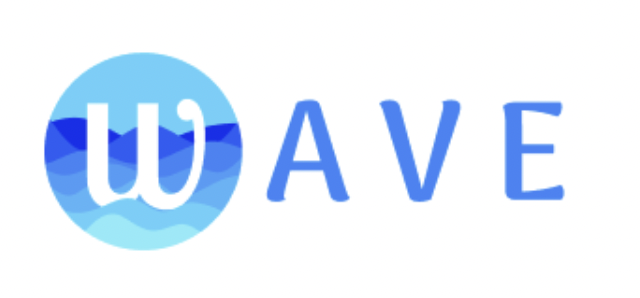
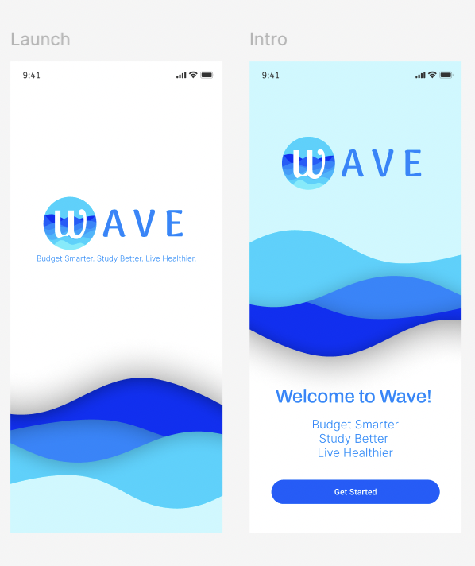
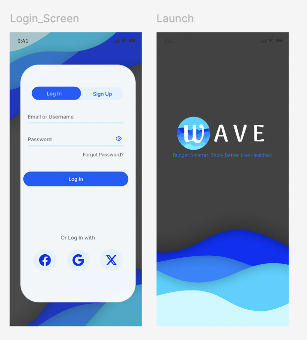
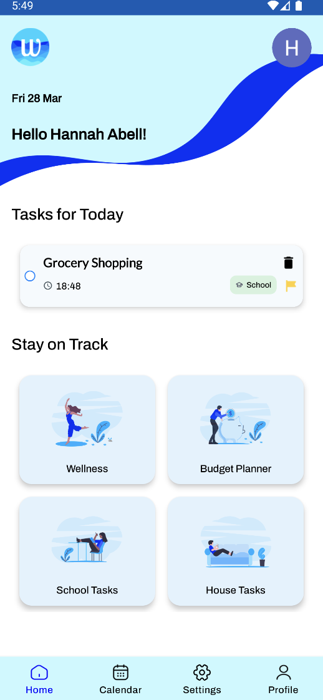
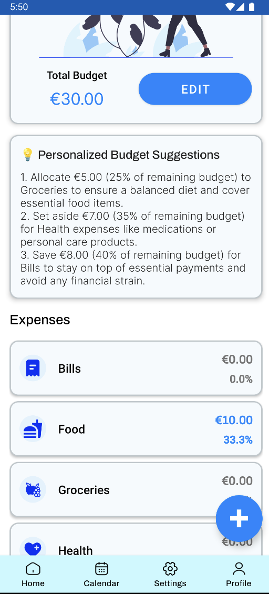
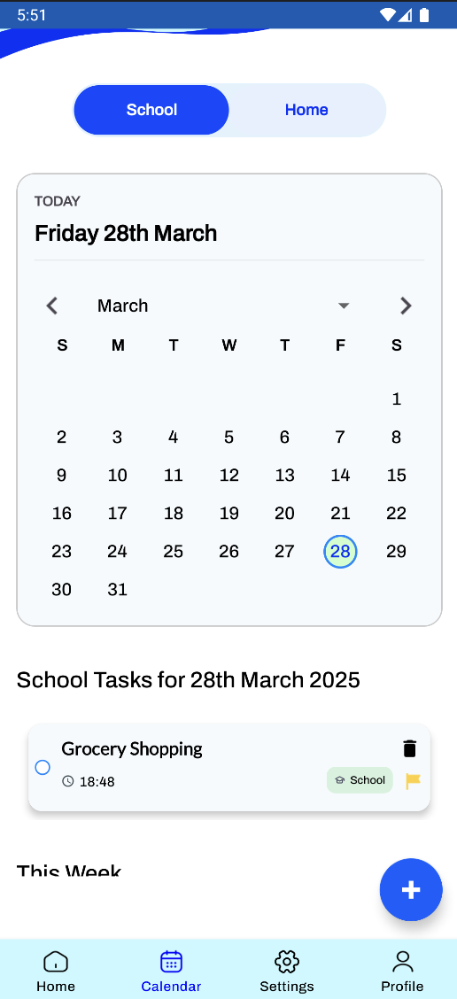
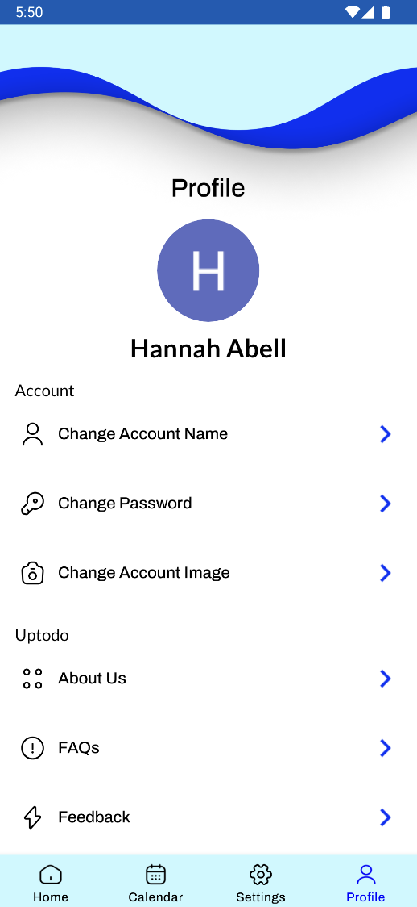

<!-- PROJECT LOGO -->
<br />
<div align="center">
  <a href="https://github.com/syro13/Wave_Frontend_Source_Code">
    
  </a>
 <p align="center">
    Wave is a wellbeing application designed specifically to support college students who want help in managing various aspects of their overwhelming and busy lives. Not only recognising this, but experiencing it, is what helped us to come up with this idea. Wave aims to help in a wide range of tasks from financial budgeting advice to task management down to general wellbeing, all in the aim of creating a better college experience and minimising the possibility of burning out.
    <br />
    <a href="https://github.com/syro13/Wave_Frontend_Source_Code"><strong>Explore our repo »</strong></a>
    <br />
    <br />
    <a href="https://github.com/syro13/Wave_Frontend_Source_Code">View Demo</a>
    &middot;
    <a href="https://github.com/syro13/Wave_Frontend_Source_Code/issues/new?labels=bug&template=bug-report---.md">Report Bug</a>
  </p>
</div>

## 📺 Watch Wave in Action
<div align="center">
  <a href="https://youtu.be/LY6wttN-gVk">
    
  </a>
  <p>Click the image above to watch our demo video</p>
</div>

<!-- TABLE OF CONTENTS -->
## 📑 Table of Contents
<details open>
  <summary>Click to expand/collapse</summary>
  <ol>
    <li><a href="#-about-the-project">About The Project</a></li>
    <li><a href="#-built-with">Built With</a></li>
    <li><a href="#-tech-stack">Tech Stack</a></li>
    <li>
      <a href="#-getting-started">Getting Started</a>
      <ul>
        <li><a href="#-prerequisites">Prerequisites</a></li>
        <li><a href="#-installation">Installation</a></li>
      </ul>
    </li>
    <li><a href="#-usage">Usage</a></li>
    <li><a href="#-modules-overview">Modules Overview</a></li>
    <li><a href="#-appearance-modes">Appearance Modes</a></li>
    <li><a href="#-roadmap">Roadmap</a></li>
    <li><a href="#-screenshots">Screenshots</a></li>
    <li><a href="#-testing">Testing</a></li>
    <li><a href="#-localization">Localization</a></li>
    <li><a href="#license">License</a></li>
    <li><a href="#contact">Contact</a></li>
    <li><a href="#-feedback--suggestions">Feedback & Suggestions</a></li>
  </ol>
</details>

## 📱 About The Project
Wave is a comprehensive wellbeing application tailored for college students facing the challenges of academic life. Our app addresses key areas including task management, financial planning, and mental wellbeing through an intuitive, AI-enhanced interface.

## 🛠️ Built With

* [](https://developer.android.com/studio)
* [](https://www.oracle.com/java/)
* [](https://developer.android.com/guide/topics/resources/layout-resource)
* [](https://firebase.google.com/)
* [](https://openai.com/)
* [](https://airbnb.io/lottie/#/)

## 🔄 Tech Stack
<div align="center">
  
  <p><i>Our comprehensive technology architecture powering Wave</i></p>
</div>

## 🚀 Getting Started

Follow these steps to get a local copy of the **Wave** app up and running on your machine.

### 📋 Prerequisites

Make sure you have the following installed:

- [Android Studio](https://developer.android.com/studio)
- [Java JDK 17+](https://www.oracle.com/java/technologies/javase-downloads.html)
- [Firebase Account](https://firebase.google.com/)
- [OpenAI API Key](https://platform.openai.com/)
- Internet connection (for API requests and Gradle sync)

### 🔧 Installation

1. **Clone the repository**

```bash
git clone https://github.com/your-username/Wave_Frontend_Source_Code.git
```

## 📱 Usage

Wave is designed to support students in managing their day-to-day life with ease, balance, and wellbeing. Here are a few key features in action:

### 🧠 AI-Powered Suggestions
Get intelligent task breakdowns and wellness tips based on your mood, time, and mental load.

Example Prompt: "Suggest a 30-minute wellness plan for a stressed student."
→ AI Response: "Take a 10-minute walk, journal your thoughts for 5 minutes, then listen to a calming playlist."

### 🏠 Home and School Task Management
Track and manage home chores easily. Tasks are categorized and color-coded based on their status: Pending, Completed, Cancelled, or Overdue.

### 💰 Budgeting Made Easy
Track your daily and weekly expenses with a clean, user-friendly budgeting interface. Get insights on where your money goes and receive AI-generated tips to save better.

📌 Example:
```text
Spent €20 so you have €160 left.
→ AI Suggestion: "Try cooking at home more this week. Here's a simple 3-day meal plan under €15."
```

### 🧾 Grocery & Notes
Use the grocery list popup to quickly jot down and check off daily household items.

### 🔁 Calendar Sync
View all your tasks in a calendar view to plan your week visually.

### 🌿 Wellbeing API
Wave connects to a custom-built Wellbeing API that offers blogs and podcasts to help you relax. Perfect for when you're feeling stressed, tired, or unmotivated. 

✅ Supports:

* Mindfulness 
* Sleep routine 
* Study/life balance plans
* Encouraging wellness 

## 🧩 Modules Overview

- `app/` - Contains the main Android app codebase
- `images/` - Screenshots and logos for documentation
- `gradle/` - Project build configuration
- Firebase - Authentication, Firestore, and storage
- OpenAI - Handles AI requests (for task and wellbeing suggestions)

## 🌓 Appearance Modes

Wave supports both light and dark modes to accommodate different preferences and reduce eye strain during night-time usage.

<div align="center">
   &nbsp;&nbsp;
  
  <p><i>Toggle between light and dark modes in the settings for optimal viewing comfort</i></p>
</div>

### Features:
- **Automatic switching** based on system settings
- **Manual override** in app settings
- **Battery saving** benefits with dark mode
- **Reduced eye strain** in low-light environments

## 🛣️ Roadmap

- [x] Splash Screen + Launch Flow  
- [x] Onboarding Screens  
- [x] Firebase Authentication (Login & Signup)  
- [x] Dashboard with Navigation Bar  
    - [x] Home Tasks Page  
    - [x] School Tasks Page  
    - [x] Budgeting Interface  
    - [x] Wellness (AI-Powered Advice & Prompts)  
- [x] Calendar View  
    - [x] Combined Home + School Tasks Calendar  
    - [x] Filtered Fragments for Each Task Type  
- [x] Profile Page with User Info & Picture
    - [x]  Ability to change account name and profile picture
- [x] Settings Screen  
    - [x] Offline Task Access  
    - [x] Dark/Light mode Toggling
    - [x] Up to date calendar 
    - [x] Privacy Policy
- [ ] Personalized notifications
- [ ] Multiple language offers
- [ ] More AI features

See the [open issues](https://github.com/github_username/repo_name/issues) for a full list of proposed features (and known bugs).

## 📸 Screenshots

<div align="center">
   &nbsp;
   &nbsp;
   &nbsp;
  
</div>

> _More screenshots available in the `/images` folder._

## 🧪 Testing

Wave uses basic instrumentation tests for critical flows.

To run tests:

```bash
./gradlew test
```

## 🌍 Localization

Wave is currently available in English. Future support for additional languages is in the roadmap!

## License

Distributed under the project_license. See `LICENSE.txt` for more information.

## Contact

* Hannah Abell - hannah@wave.ie
* Raveena Ratham - raveena@wave.ie
* Jakub Lowis- jakub@wave.ie
* Nojus Mautsevicius - nojus@wave.ie
* Nebi Anil Atici - nebi@wave.ie

Project Link: [https://github.com/syro13/Wave_Frontend_Source_Code](https://github.com/syro13/Wave_Frontend_Source_Code)

## 📢 Feedback & Suggestions

We're always looking to improve. Feel free to open an [issue](https://github.com/syro13/Wave_Frontend_Source_Code/issues) or submit a [pull request](https://github.com/syro13/Wave_Frontend_Source_Code/pulls)!
